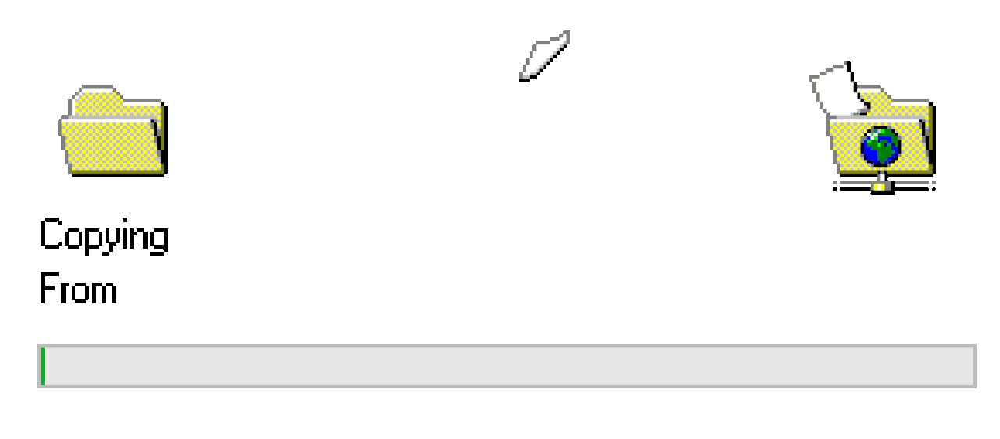

# AvaloniaWindowsAndLinuxButtonPressCounter
Sample Avalonia application to learn building C# projects on Linux! 😇

This README will tell you how to do this manually. If you however prefer a bash script to automate this process, look [here](docs/cloneGitAndBuildAndRunDotNetProject.sh) for a pre-made script.

## How to build this application on Linux
*Please note that for this project we used Debian Bookworm. 📚 We advice beginners following this guide to do the same!*

### Installing git


*If you are not using Debian please refer to [this](https://git-scm.com/downloads/linux) page on installing git.*

- If you are using Debian, install git in the terminal using:
```sh
sudo apt-get install git
```

### Cloning the repository to your Linux machine


*Note: this tutorial assumes the repository is public! If it is not, please follow the instructions in your terminal upon cloning the repository.*

- Navigate to the directory where you want to clone the repository to:
```sh
cd path/to/your/directory
```

- Clone the repository using git:
```sh
git clone https://github.com/pkg-dot-zip/AvaloniaWindowsAndLinuxButtonPressCounter.git
```

- Verify whether cloning was succesful by checking the folders. 👀 You can do this in the file explorer of your choice or using the terminal. You can list directories in your current path by using:
```sh
ls
```

### Installing dotnet
- Put the following in your terminal and press enter:
```sh
wget https://packages.microsoft.com/config/debian/10/packages-microsoft-prod.deb
sudo dpkg -i packages-microsoft-prod.deb
```

- Good job! 😙 Lets update the package list and install the required packages. 😎
```sh
sudo apt-get update
sudo apt-get install -y apt-transport-https
```

- Now install the dotnet sdk. Note that we are using version 8 here since that is what we used to build this sample project! 😁
```sh
sudo apt-get install -y dotnet-sdk-8.0
```

### Building the project


Finally we got to your magnum opus! 🤩⭐

- If you are not in your repository folder, navigate to it using:
```sh
cd path/to/your/directory
```

- Run the following command:
```sh
dotnet restore
```

- Now build the application! 👷‍♂️
```sh
dotnet build
```

### Running the project


Now lets put all your hard work to the test! 💪

- Run the project using:
```sh
dotnet run --project AvaloniaWindowsAndLinuxButtonPressCounter.Desktop
```

We use the --project specification because we do not have a project in our solution directory! 🧪 We want to build the desktop project hence we specify that folder. 😌